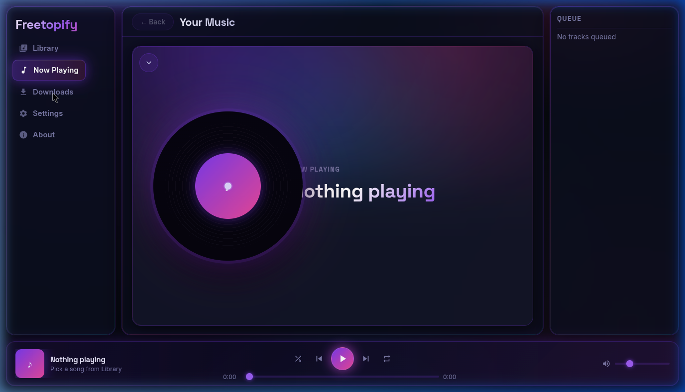

# Freetopify

> **Your music. Your server. Your rules.**  
> A self-hosted, folder-first music player with a sleek dark-neon web client — built for people who know exactly where their files live.



---

## What is it?

Freetopify is a **private music server** you run on your own machine or home network.  
No subscriptions. No cloud. No algorithm deciding what you hear next.

You point it at your music folders, and it gives you a beautiful browser interface to play, queue, and download — from any device on your network.

---

## Features

| | |
|---|---|
| 🗂 **Folder-first library** | Browse your real disk structure — no import, no scan delay |
| 🔐 **PIN-gated guest access** | Share with friends without handing over your password |
| ⬇️ **Built-in downloader** | YouTube → MP3/M4A straight into your library via `yt-dlp` |
| 🎛 **Queue & playback controls** | Shuffle, repeat, skip — keyboard shortcuts included |
| 📡 **Live sync** | WebSocket pushes library updates to all connected clients in real time |
| 📱 **Fully responsive** | Works on desktop, tablet, and phone — same interface, perfectly scaled |
| 🌐 **Zero cloud dependency** | Runs entirely on your LAN — no internet required to play music |
| 🔍 **mDNS discovery** | Find your server on the local network by name, no IP hunting |

---

## Quick Start

```bash
# 1. Install
./install.sh

# 2. Activate the environment
source venv/bin/activate

# 3. Run tests
pytest -q server/tests/test_api.py

# 4. Start the server
./scripts/run_server.sh
```

Open `http://<your-machine-ip>:7171` in any browser on your network.

---

## Login

- **Admin** — sign in with the credentials set in `.env`
- **Guest** — join with a display name and the shared `GUEST_PIN`
- The login screen is minimal by design: pick a role, fill only what's needed

---

## Configuration

| Variable | Default | Purpose |
|---|---|---|
| `ADMIN_USERNAME` | `admin` | Admin login name |
| `ADMIN_PASSWORD` | — | Admin password (set in `.env`) |
| `GUEST_PIN` | _(disabled)_ | Enable guest access with this PIN |
| `GUEST_TOKEN_EXPIRE_HOURS` | `1` | How long guest sessions last |
| `SECURE_COOKIES` | `false` | Set `true` when running behind HTTPS |
| `MUSIC_DIR` | — | Root folder Freetopify serves from |

---

## Stack

- **Server** — Python · FastAPI · aiosqlite · WebSockets · yt-dlp · mutagen
- **Web client** — Vanilla HTML · CSS · ES Modules (no build step, no npm)
- **Auth** — PyJWT · bcrypt · rate-limited login

---

## Docs

- [`docs/prd.md`](docs/prd.md) — Product requirements
- [`docs/server.md`](docs/server.md) — Server architecture
- [`docs/web.md`](docs/web.md) — Web client design system & rules
- [`docs/android.md`](docs/android.md) — Android app plan (upcoming)
- [`docs/changelog.md`](docs/changelog.md) — Full change history

---

## Health Check

```
GET http://127.0.0.1:7171/api/v1/system/health
```

---

## License

[Freetopify Personal Use License](LICENSE)  
Free for personal use. Commercial use and monetization require explicit written permission.
