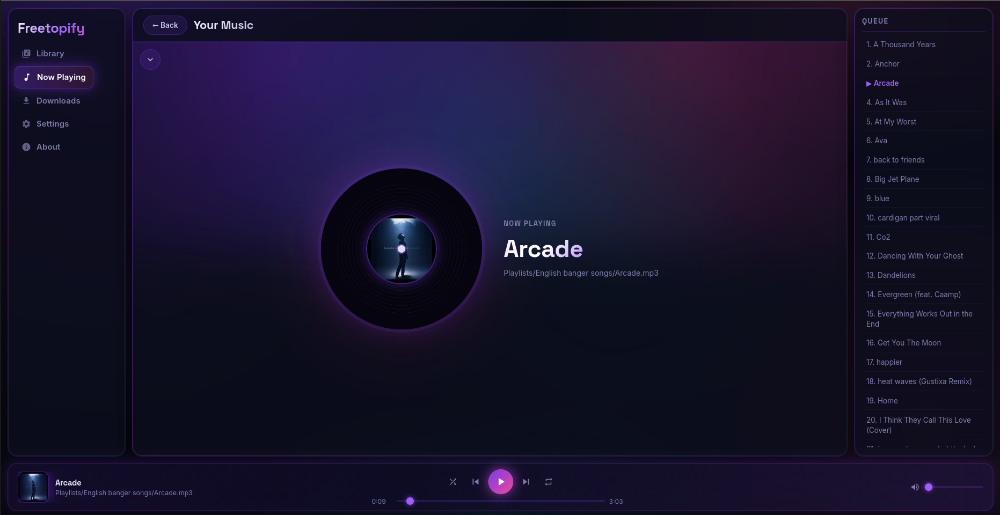

# Freetopify

> **Your music. Your server. Your rules.**  
> A self-hosted, folder-first music player with a sleek dark-neon web client —  
> built for people who actually own their music.



---

## What is it?

Freetopify is a **private music server** you run on your own machine or home network.  
No subscriptions. No cloud. No algorithm deciding what you hear next.

Point it at your music folders and get a beautiful browser interface to play, queue, browse, and download — from any device on your network.

---

## Features

| | |
|---|---|
| 🗂 **Folder-first library** | Browse your real disk structure — no import, no forced scan delay |
| ⬇️ **Smart downloader** | YouTube → MP3/FLAC straight into your library via `yt-dlp` + visual folder |
| 📜 **Download history** | Permanent local log of every downloaded track |
| 🎛 **Full playback controls** | Shuffle, repeat, queue, skip — keyboard shortcuts included |
| 🔐 **PIN-gated guest access** | Share with friends without handing over your password |
| 📡 **Live sync** | WebSocket pushes library updates to all connected clients in real time |
| 📱 **Fully responsive** | Desktop · tablet · phone — same interface, perfectly scaled |
| 🌐 **Zero cloud dependency** | Runs entirely on your LAN — no internet needed to play music |
| 🎨 **Neon glassmorphism** | Dark-mode first, animated mesh background, vinyl disk spinner |

---

## Start Here (Choose Your OS)

- Linux guide: [`docs/setup-linux.md`](docs/setup-linux.md)
- macOS guide: [`docs/setup-macos.md`](docs/setup-macos.md)
- Windows guide: [`docs/setup-windows.md`](docs/setup-windows.md)

If you just want the shortest path, use the quick start below.

## Quick Start

```bash
git clone https://github.com/flexcreates/freetopify
cd freetopify
python3 freetopify.py install
python3 freetopify.py start
```

Windows (PowerShell):
```powershell
python freetopify.py install
python freetopify.py start
```

Open **`http://<your-machine-ip>:7171`** in any browser on your network.

> The installer handles everything: system packages (ffmpeg, nodejs, sqlite3),  
> Python venv, yt-dlp, browser cookie auto-detection, and secret key generation.

### One-Command Launcher (Recommended)

Use the unified launcher to avoid OS/script branching:

```bash
python3 freetopify.py            # default: start (auto-runs install first if needed)
python3 freetopify.py install    # platform-aware install flow
python3 freetopify.py start      # start server
python3 freetopify.py doctor     # show detected OS/paths
```

It auto-detects Linux/macOS/Windows, logs actions to `logs/launcher.log`, and applies fallback behavior when a preferred launcher is unavailable.

If install has already been done once, you can start directly with:
- Linux/macOS: `python3 freetopify.py`
- Windows: `python freetopify.py`

### Direct Script Mode (Advanced)

If you prefer manual script control:
- Linux start: `./scripts/run_server_linux.sh`
- macOS start: `./scripts/run_server_macos.sh`
- Windows start: `./scripts/run_server.ps1`

### Live Setup Guide
Watch how easy it is to get Freetopify running on your machine:

https://github.com/flexcreates/freetopify/raw/main/assets/live-guide.mp4

---

## Login

| Role | How |
|---|---|
| **Admin** | Username + password set during install |
| **Guest** | Display name + shared `GUEST_PIN` set during install |

---

## Downloader

The built-in downloader streams YouTube audio directly into your music library:

- **Visual folder picker** — click one or more destination folders
- **Multi-folder** — same track downloaded to multiple folders simultaneously  
- **New folder creation** — create sub-directories on the fly
- **Live SSE log** — real-time yt-dlp output per job
- **Download history** — permanent local log (`logs/download_history.log`), never deleted

Powered by `yt-dlp` with:
- Browser cookie passthrough (`YTDLP_BROWSER`) to bypass YouTube rate limits
- Official EJS challenge solver (`--remote-components ejs:github`) for full format access
- Node.js runtime for signature solving (installed automatically by platform install scripts via `python3 freetopify.py install`)
- Auto-retry on 429 with exponential backoff

### CLI Downloader (Optional)

Use the dedicated media CLI orchestrator:

```bash
python3 freetopify_media.py download
```

What it does:
- Reads default music path from `.env` (`MUSIC_LIBRARY_PATH`)
- Lets you pick existing folder(s) or create a new folder path
- Asks for YouTube URL, download type, and format (`mp3`/`flac`)
- Downloads with server-aligned yt-dlp settings and logs to `~/Scripts/logs/`

### Safe Music Organizer (Optional)

```bash
python3 freetopify_media.py organize
```

You can still use `python3 freetopify.py download|organize`; it delegates to `freetopify_media.py`.

This script is intentionally minimal and safe:
- Uses `.env` music root by default
- Moves loose audio files into `Music/Singles`
- Moves playlist files into `_playlists`
- Avoids artist-per-folder explosion

---

## Configuration

Copy `.env.example` to `.env` (the installer does this automatically).

| Variable | Default | Purpose |
|---|---|---|
| `ADMIN_USERNAME` | `admin` | Admin login name |
| `ADMIN_PASSWORD` | `freetopify` | Admin password — **change this** |
| `MUSIC_LIBRARY_PATH` | `~/Music/freetopify` | Root folder of your music library |
| `GUEST_PIN` | _(set in install, blank disables)_ | Shared PIN for guest access |
| `YTDLP_BROWSER` | _(auto-detected)_ | Browser for cookie passthrough (`firefox`\|`chrome`) |
| `DEFAULT_DOWNLOAD_FORMAT` | `mp3` | Download format: `mp3` \| `flac` \| `ogg` \| `m4a` |
| `DEFAULT_DOWNLOAD_BITRATE` | `320k` | Audio bitrate (max quality for MP3) |

Full reference: [`.env.example`](.env.example)

---

## Stack

| Layer | Technology |
|---|---|
| **Server** | Python 3.11+ · FastAPI · uvicorn · aiosqlite |
| **Media** | mutagen · yt-dlp · ffmpeg · Node.js (EJS solver) |
| **Auth** | PyJWT · bcrypt · rate-limited login · HttpOnly Cookies |
| **Live updates** | WebSockets · Server-Sent Events (SSE) |
| **Web client** | Vanilla HTML · CSS · ES Modules — no build step, no npm |

---

## Docs

| File | Contents |
|---|---|
| [`docs/setup-linux.md`](docs/setup-linux.md) | Linux install/start/update commands |
| [`docs/setup-macos.md`](docs/setup-macos.md) | macOS install/start/update commands |
| [`docs/setup-windows.md`](docs/setup-windows.md) | Windows install/start/update commands |
| [`docs/server.md`](docs/server.md) | Server architecture, API reference, watcher rules |
| [`docs/web.md`](docs/web.md) | Web client design system, module map, test checklist |
| [`docs/prd.md`](docs/prd.md) | Product requirements |
| [`docs/android.md`](docs/android.md) | Android app roadmap (upcoming) |
| [`docs/changelog.md`](docs/changelog.md) | Full change history |

---

## Health Check

```
GET http://127.0.0.1:7171/api/v1/system/health
```

---

## License

[Freetopify Personal Use License](LICENSE)  
Free for personal, non-commercial use. Commercial use requires explicit written permission from the author.
